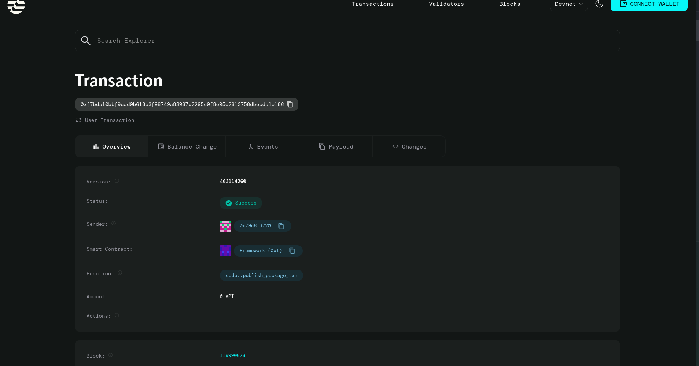

P2P Car Rental Smart Contract (Aptos Move)

This repository contains a simple peer-to-peer car rental smart contract written in the Move language for the Aptos blockchain. The contract demonstrates how decentralized applications can handle rental agreements and payments directly on-chain without intermediaries.

The implementation is intentionally minimal and designed for learning, college projects, and hackathon submissions.

Project Overview

The smart contract enables:

Car owners to list a car for rent with a fixed price

Users to rent a listed car by paying the rental fee

On-chain storage of rental state and participant addresses

All logic is executed within the Aptos blockchain using Move smart contracts.

Smart Contract Details# P2P Car Rental Smart Contract (Aptos Move)

This repository contains a simple peer-to-peer car rental smart contract written in the Move language for the Aptos blockchain. The contract demonstrates how decentralized applications can manage rental agreements and payments directly on-chain without intermediaries.

The implementation is intentionally minimal and designed for learning purposes, college projects, and hackathon submissions.

---

## Project Overview

The smart contract enables:
- Car owners to list a car for rent with a fixed price
- Users to rent a listed car by paying the rental fee
- On-chain storage of rental state and participant addresses

All logic is executed within the Aptos blockchain using Move smart contracts.

---

## Smart Contract Details

### Module
MyModule::CarRental

### Data Structure

struct Rental {
    owner: address,
    renter: address,
    price: u64,
    active: bool,
}

- owner: Address of the car owner
- renter: Address of the renter
- price: Rental price in AptosCoin
- active: Indicates whether the car is available for rent

---

## Functions

### create_rental

Signature:
public fun create_rental(owner: &signer, price: u64)

Description:
- Called by the car owner
- Creates and stores a new rental listing on-chain
- Marks the rental as active

---

### rent_car

Signature:
public fun rent_car(renter: &signer, car_owner: address)

Description:
- Transfers the rental price from renter to car owner
- Records the renter’s address
- Marks the rental as inactive

---

## Payment Handling

- Uses AptosCoin
- Transfers are handled using the Aptos coin framework
- No escrow or third-party involvement

---

## Project Structure

.
├── sources/
│   └── CarRental.move
├── Move.toml
└── README.md

---

## Move.toml Configuration

[addresses]
MyModule = "0x1"

The address alias must match the module declaration in the smart contract.

---

## How to Compile

Ensure the Aptos CLI is installed.

aptos move compile

---

## Limitations

This contract is a basic prototype and does not include:
- Time-based rental periods
- Security deposits
- Insurance or damage claims
- Rental cancellation logic
- Advanced access control

---

## Future Improvements

- Rental duration and expiry handling
- Refundable security deposits
- Insurance integration
- Support for multiple cars per owner
- Event emission for frontend applications

---

## Intended Use

This project is suitable for:
- Learning Move and Aptos smart contracts
- Academic and college projects
- Hackathon demonstrations
- Blockchain development portfolios

---

## Author

Guru Vishal  
B.E. Computer Science Engineering  
Blockchain and Cybersecurity Enthusiast

---

## License

This project is licensed under the MIT License.
Module
MyModule::CarRental

Data Structure

The contract uses a single struct to represent a rental agreement:

struct Rental {
    owner: address,
    renter: address,
    price: u64,
    active: bool,
}

owner: Address of the car owner

renter: Address of the renter

price: Rental price in AptosCoin

active: Indicates whether the car is available for rent

Functions
create_rental

Signature:

public fun create_rental(owner: &signer, price: u64)

Description:

Called by the car owner

Creates and stores a new rental listing on-chain

Marks the rental as active

rent_car

Signature:

public fun rent_car(renter: &signer, car_owner: address)

Description:

Transfers the rental price from renter to car owner

Records the renter’s address

Marks the rental as inactive

Payment Handling

Uses AptosCoin for payments

Transfers are handled through the Aptos coin framework

No escrow or third-party involvement

Project Structure
.
├── sources/
│   └── CarRental.move
├── Move.toml
└── README.md

Move.toml Configuration

The module address must be defined correctly in Move.toml:

[addresses]
MyModule = "0x1"

The address alias must match the module declaration in the smart contract.

How to Compile

Ensure the Aptos CLI is installed.

Run:

aptos move compile

Limitations

This contract is a basic prototype and does not include:

Time-based rental periods

Security deposits

Insurance or damage claims

Rental cancellation logic

Advanced access control

These features can be added in future iterations.

Future Improvements

Rental duration and expiry handling

Refundable security deposits

Insurance integration

Support for multiple cars per owner

Event emission for frontend applications

Intended Use

This project is suitable for:

Learning Move and Aptos smart contracts

Academic and college projects

Hackathon demonstrations

Blockchain development portfolios

Author

Guru Vishal
B.E. Computer Science Engineering
Blockchain and Cybersecurity Enthusiast

License

This project is licensed under the MIT License.